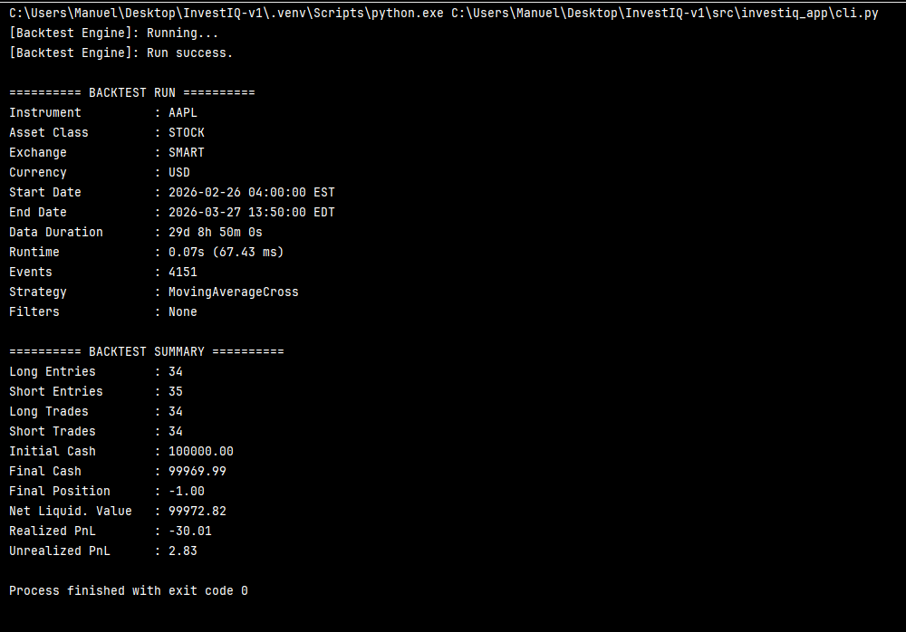
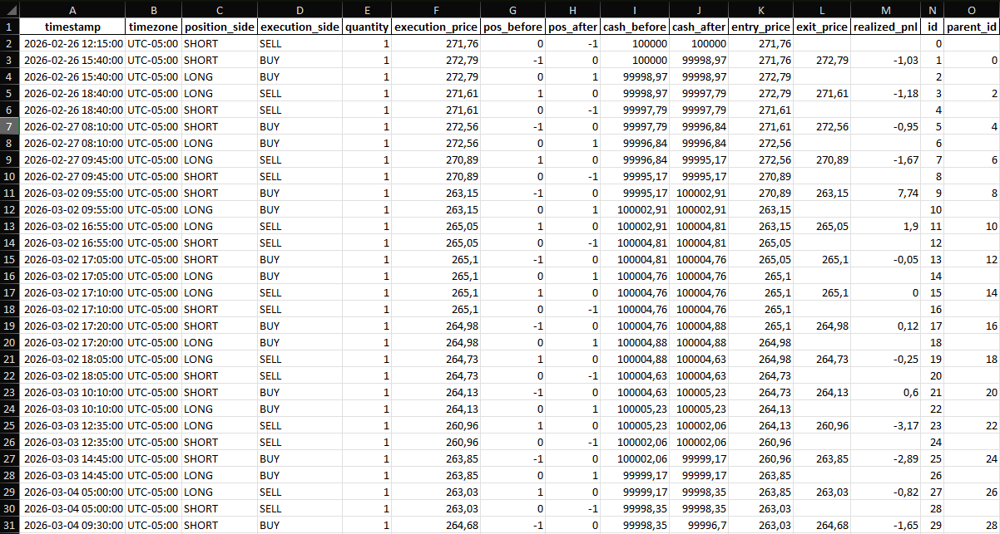

# 1. InvestIQ — Backtest & Execution Engine (v1)

## Overview

InvestIQ is a trading backtest and execution engine designed to simulate the behavior of trading strategies in a controlled and deterministic environment.

This first version focuses on building a **coherent and reliable core**, with clear separation between:

- Market data
- Decision logic
- Execution
- Portfolio state

The goal is to provide a transparent system where results can be inspected, understood, and extended.

---
# 2. Core Components

## 1. Market Data

- Historical data ingestion (IBKR)
- Event-driven feed
- Time-ordered processing

## 2. Decision Pipeline

- Strategy-driven signal generation
- Stateless decision logic
- Clean separation from execution

## 3. Execution Engine

- Market orders
- Transition-based execution model
- Deterministic order handling

## 4. Portfolio (FIFO)

- Position tracking (long / short)
- FIFO position matching
- Realized & Unrealized PnL

## 5. Reporting

- Structured logs (terminal)
- Excel export (fills & metrics)
- Backtest summary (PnL, trades, positions)

---
# 3. Output Example

The engine produces :
## 3.1 Terminal Summary



- Instrument, exchange, currency
- Start / End timestamps (with timezone)
- Data duration & runtime
- Entries / trades (long & short)
- PnL (realized / unrealized)
- Net liquidation value

---
## 3.2 Excel Export



- Fill log (entry / exit / price / quantity)
- Position transitions
- Portfolio evolution

---
# 4. Getting started

## 4.1 Download the project

Download the repository from GitHub:

- Click **Code → Download ZIP**
or
- Clone it using Git:
``` bash
git clone <repo-url>
```

---
## 4.2 Extract the archive

Download the repository from GitHub:

If you downloaded a `.zip` file:
- Extract it
- Open the project folder in your terminal or IDE

Expected structure:

```
InvestIQ-v1/  
├── src/  
├── README.md  
└── ...
```

---
## 4.3 Create a virtual environment

From the project root:

### Windows

``` bash
python -m venv .venv
```

``` bash
.venv\Scripts\activate
```

---
## 4.4 Install dependencies

```bash
pip install -e .
```

---

# 5. Download and Launch TWS / IB Gateway

Before running the engine, Interactive Brokers must be running.
### Steps:


1. Download **Trader Workstation (TWS)** or **IB Gateway**
2. Open TWS
3. Log in to your **`SIMULATED`** account

In TWS:

- `File → Global Configuration`
- `API → Settings`
- Enable **"ActiveX and Socket Clients"**
- Disable "**Read-Only API**"

Typical ports:

- **7497** (Paper)
- **7496** (Live)

---
# 6. Verify API connection

Make sure:

- TWS is running
- The correct port is configured
- Local connections are allowed

---
# 7. Run a backtest

Once everything is ready :

```bash
python src/investiq_app/cli.py
```
---
# 8. Customization

## 8.1 Change the instrument

Instruments are configured through `BacktestConfig` using `InstrumentFactory.`

Example :
```python
backtest_config = BacktestConfig(
    instrument=InstrumentFactory.cont_future(symbol="MNQ"),
    ...
)
```

Supported instrument factories currently include :

```python
InstrumentFactory.cont_future("MNQ")
InstrumentFactory.stock("AAPL")
InstrumentFactory.forex("EURUSD")
```

You can change:
- symbol
- exchange
- tick size
- lot size
- contract multiplier
- currency

---
## 8.2 Change the backtest length and granularity

Historical data settings are configured through `MarketDataRequest`.

Example :

```python
market_data_request=MarketDataRequest(
    bar_size=BarSize.ONE_HOUR,
    duration="1 M"
)
```

Typical changes include :

- ONE_MINUTE 
- FIVE_MINUTES
- FIFTEEN_MINUTES
- THIRTY_MINUTES
- ONE_HOUR 
- FOUR_HOURS
- ONE_DAY
- ONE_WEEK

and :

```python
duration="1 D"
duration="1 W"
duration="1 M"
duration="3 M"
duration="1 Y"
```

This allows you to control:

- the time span of the historical dataset
- the resolution of the bars used by the strategy

---
## 8.3 Feature Engineering

Features are derived signals computed from market data and used by strategies.
They are updated at each step through **feature pipelines** and exposed via a read-only view.

---
### How it works

At each step:

1. Market data is updated
2. Feature pipelines compute values
3. Results are stored in the `FeatureStore`
4. Strategies read features from `features_view`

---
### Example: SMA pipeline

```python
@register_feature_pipeline
class SMAPipeline:
    NAME = "SMA_FAST_SLOW"
```

This pipeline computes:
- `ma_fast`
- `ma_slow`

Values are updated incrementally and become available once enough data is collected.

---
### Using features in a strategy

```python
def decide(self, view):
    ma_fast = view.features_view["ma_fast"]
    ma_slow = view.features_view["ma_slow"]
```

---
### Create a new feature

```python
@register_feature_pipeline  
class MyFeaturePipeline:  
NAME = "MY_FEATURE"  
  
def reset(self):  
...  
  
def update(self, *, market_store, feature_store):  
value = ...  
feature_store.set_value("my_feature", value)  
feature_store.set_pipeline_ready(self.NAME)
```

---
### Key principles

- deterministic (same input → same output)
- incremental updates
- isolated pipelines
- compatible with backtesting replay

---
## 8.4 Strategy Engineering

A strategy is responsible for producing a **target position** from the current backtest view.

It reads:

- market data
- computed features
- portfolio state

and returns a `Decision`.

---
### How it works

At each step:

1. The `DecisionPipeline` calls the strategy
2. The strategy reads the current `BacktestView`
3. It returns a target position and execution price
4. Filters are applied afterwards (if configured)

---
### Strategy metadata

Each strategy defines metadata describing:

- its name and version
- its parameters
- the required market fields
- the required feature pipelines
- the required features

This allows the `DecisionPipeline` to validate the configuration before the run starts.

---
### Example: Moving Average Cross

```python
class MovingAverageCrossStrategy:
    def decide(self, view: BacktestView) -> Decision:
        ...
```

This strategy:

- reads `ma_fast` and `ma_slow`
- checks pipeline readiness
- returns:
    - `1.0` for long
    - `-1.0` for short
    - `0.0` for flat

---
### Creating a new strategy

To add a new strategy:

1. Create a class with a `metadata` object
2. Implement `decide(view)`
3. Return a `Decision`
4. Use it in `BacktestConfig`

```python
class MyStrategy:
    def __init__(self):
        self.metadata = StrategyMetadata(
            name="MyStrategy",
            version="1.0.0",
            description="...",
            parameters={},
            price_type=MarketField.CLOSE,
            required_fields=frozenset({MarketField.CLOSE}),
            required_pipelines=frozenset(),
            required_features=frozenset(),
        )

    def decide(self, view: BacktestView) -> Decision:
        
        # Put here your logic using BacktestView...
        
        return Decision(
            timestamp=view.market_view.timestamp,
            target_position=0.0,
            execution_price=view.market_view.bar.close,
            diagnostics={},
        )
```

---
### Key principles

- strategies are stateless decision components
- they only read from `BacktestView`
- they do not mutate portfolio or market state
- they must be deterministic

---
## 8.5 Filter Engineering

Filters are optional components applied **after the strategy** to modify or constrain decisions.

They allow you to add rules such as:

- risk limits
- position caps
- trade blocking conditions

---
### How it works

At each step:

1. The strategy produces a `Decision`
2. Each filter is applied sequentially
3. The final decision is passed to execution

---
### Filter interface

A filter receives:

- the current `BacktestView`
- the current `Decision`

and returns a **new `Decision`**

```python
class MyFilter:
    def apply(self, view, decision) -> Decision:
        ...
```

---
### Metadata

Each filter defines metadata describing:

- its name and version
- its parameters
- required features
- required market fields

---
### Creating a filter

```python
class MyFilter:
    def __init__(self):
        self.metadata = FilterMetadata(
            name="MyFilter",
            version="1.0.0",
            description="...",
            parameters={},
            required_features=frozenset(),
            required_market_fields=frozenset(),
        )

    def apply(self, view: BacktestView, decision: Decision) -> Decision:
        return decision
```

---
### Key principles

- filters do not mutate state
- they only transform decisions
- they are applied sequentially
- they must be deterministic

---
# 9. Metrics

The engine computes:

- Realized PnL
- Unrealized PnL (mark-to-market)
- Net Liquidation Value (NLV)
- Final cash
- Final position
- Trade counts (entries & closed trades)

---
# 10. Design Principles

- Deterministic behavior
- Clear state ownership
- Separation of concerns
- Transparency over complexity

---
# 11. Current Limitations (v1.1)

- No native stop / limit orders (handled manually)
- No replayable event journal
- No unit / integration test coverage
- Partial execution model (market orders only)

---
# 12. Roadmap (v1.2)

- Native stop & limit orders
- Full replayability (event-driven journal)
- Deterministic re-run guarantees
- Unit & integration testing
- Improved execution realism

---
# 13. Status

Version 1 is complete and functional.  
The system has been built end-to-end with a focus on correctness and clarity rather than feature completeness.
